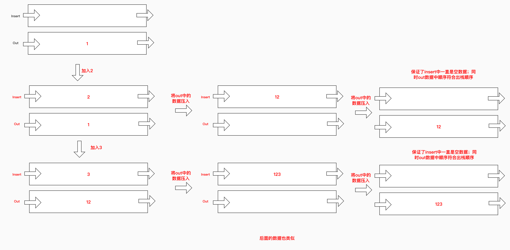

# 解题思路
由于要求使用两个队列实现类似于栈的数据类型，那么先理解下什么是队列，什么是栈。

* 栈：一种先进后出的数据结构
* 队列：一种先进先出的数据结构

那么如何用两个队列做出类似栈的结构呢？

​	题目提示可以使用两个队列来实现，栈分为入栈和出栈两个操作，那么用两个队列用来做。如同小时候大部分人都玩过的游戏----汉诺塔

就是上面这个类似的结构，具体的算法实现思路如下：（主要是push的操作）

* 定义两个队列insert（插入）和out（取出）
* 例如（插入12345）
  * insert队列放入1，转移到out（保证out中有数据）
  * insert队列放入2，将out中的数据（这里为1）放入，然后转移insert（此时为21）
* 取出时就按照out中的顺序取出

## 1.1代码

```java
public class MyStack {
    Queue<Integer> insertQueue;
    Queue<Integer> outQueue;

    public MyStack() {
        insertQueue = new LinkedList<>();
        outQueue = new  LinkedList<>();
    }

    public void push(int x) {
        //放入新数据
        insertQueue.offer(x);
        //将out里面的数据压入
        while (!outQueue.isEmpty()){
            insertQueue.offer(outQueue.poll());
        }
        //将insert里的数据压入out，保证insert一直没有数据
        while (!insertQueue.isEmpty()){
            outQueue.offer(insertQueue.poll());
        }
    }

    public int pop() {
        return outQueue.poll();
    }

    public int top() {
        return outQueue.peek();
    }

    public boolean empty() {
        return outQueue.isEmpty();
    }
}
```

## 1.2复杂度分析

* 插入数据
  * 时间复杂度：O(n),需要两次调换insert和out队列中的数据
  * 空间复杂度：O(1)
* 取出数据（pop和top）
  * 时间复杂度：O(1)
  * 空间复杂度：O(1)
