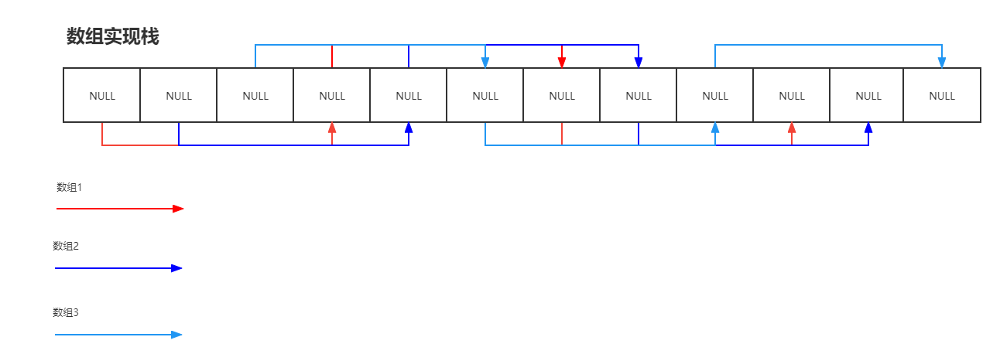

# 解题思路

使用数组实现3个栈，构造参数传入数字记为N，该数组的长度为3N；



结构上图

## 1.1 代码

```java
public class TripleInOne {
    private Integer[] values;

    private Integer[] indexes;
    public TripleInOne(int stackSize) {
        values =  new Integer[3*stackSize];
        indexes = new Integer[3];
    }

    public void push(int stackNum, int value) {
        int index = indexes[stackNum] !=null?indexes[stackNum]+3 :stackNum;
        if(index < values.length){
            values[index] = value;
            indexes[stackNum] = index;
        }
    }

    public int pop(int stackNum) {
        if(indexes[stackNum]!=null){
            int index = indexes[stackNum];
            int num = values[index];
            values[index] = null;
            indexes[stackNum] = indexes[stackNum]<3?null:indexes[stackNum]-3;
            return num;
        }
        return -1;
    }

    public int peek(int stackNum) {
        return isEmpty(stackNum) ? -1 : values[indexes[stackNum]];
    }

    public boolean isEmpty(int stackNum) {
        return indexes[stackNum]==null;
    }
}
```

## 1.2 复杂度分析

* 时间复杂度分析：O(1)，所有操作都是一次push或pop数据
* 空间复杂度分析：O(3*n),n为传入长度参数