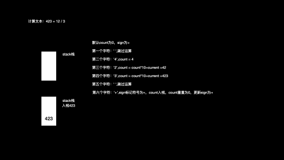

# 解题思路

本题的解题重点如下：

* 1.引入数据结构要能够进出数据，所以使用栈最好

* 2.加减法的优先级低于乘除法的优先级
* 3.减法可以理解为负数的加法，如 `3-2 = 3+（-2）`
* 4.需要处理空格的特殊情况
* 5.可能存在`45667`这样的大数字

那么，思路就很清晰了，引入一个栈，若为空格就取下一个字符，若为数字字符，就采取 `count = count*10+current`的方式来记录，当第一次遇到运算符时，记录，第二次遇到就运算；若是已经到字符串尾部，就直接入栈；最后全部出栈再相加。例如 ` 423 + 12 / 3 `,运算过程如下：



## 1.代码

```java
public class Solution{
  public int calculate(String s) {
    Stack<Integer> numStack = new Stack<>();
    int result=0;
    int count= 0;
    char sign = '+';
    for (int i = 0;i<s.length();i++){
        char index  = s.charAt(i);
        if(index>'0'){
            count = count * 10 + s.charAt(i) - '0';
        }
        if((index!=' '&&index<'0')|| i == s.length() - 1){
            switch (sign){
                case '+':
                    numStack.push(count);
                    break;
                case '-':
                    numStack.push(-count);
                    break;
                case '*':
                    numStack.push(numStack.pop()*count);
                    break;
                case '/':
                    numStack.push(numStack.pop()/count);
                    break;
                default:
            }
            sign = index;
            count = 0;
        }
    }

    while (!numStack.isEmpty()){
        result += numStack.pop();
    }

    return result;
  }
}


```

## 1.2 复杂度分析

* 时间复杂度：O(N),N为输入字符长度，需要便利一次
* 空间复杂度：O(N),用于存储结构的栈，最大长度为N，例如在 s为`12312321`这样的数据时