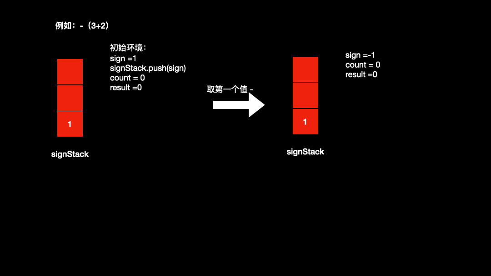

# 解题思路

本题的解题思路一开始跟 145题一样，每次记录上次的符号位，结果由于`-（3+2）`的情况无了，最终只能另寻思路，具体的分析思路如下：

* 数字的方式还是和145题一样 `count = count*10+s.charAt(i)-'0'`
* 其中`+`和`-`两个符号在基本运算时保持和145题一样
* 但是`（）`需要分开讨论（ps：-（3+2）害我）
* 引入一个sign，初始为1；引入一个signStack用来存储中间的符号位，初始push一个sign进去
  * 遇到`+`,sign为1，不变
  * 遇到`-`,sign变为-1
  * 遇到`（`,push当前的sign进去（ps：记录`（）`之前的符号位）
  * 遇到`)`signStack出栈
* 数字运算 result += sign*count；



## 1.1 代码

```java
public class Solution{
      public int calculate(String s) {
        Stack<Integer> signStack = new Stack<>();
        int count = 0;
        int sign = 1;
        int result = 0;
        int i = 0;
        signStack.push(sign);
        while (i < s.length()) {
            switch (s.charAt(i)) {
                case ' ':
                    i++;
                    break;
                case '+':
                    sign = signStack.peek();
                    i++;
                    break;
                case '-':
                    sign = -signStack.peek();
                    i++;
                    break;
                case '(':
                    signStack.push(sign);
                    i++;
                    break;
                case ')':
                    signStack.pop();
                    i++;
                    break;
                default:
                    while (i < s.length() && Character.isDigit(s.charAt(i))) {
                        count = count * 10 + s.charAt(i) - '0';
                        i++;
                    }
                    result += count*sign;
                    break;
            }
            count = 0;
        }
        return result;

    }
}
```

## 1.2 复杂度分析

* 时间复杂度：O（N），其中 N 为字符串 s 的长度。需要遍历字符串 s一次，计算表达式的值
* 空间复杂度：O（N），其中 N 为字符串 s 的长度，主要用于记录符号位，栈中元素数量不会超过N