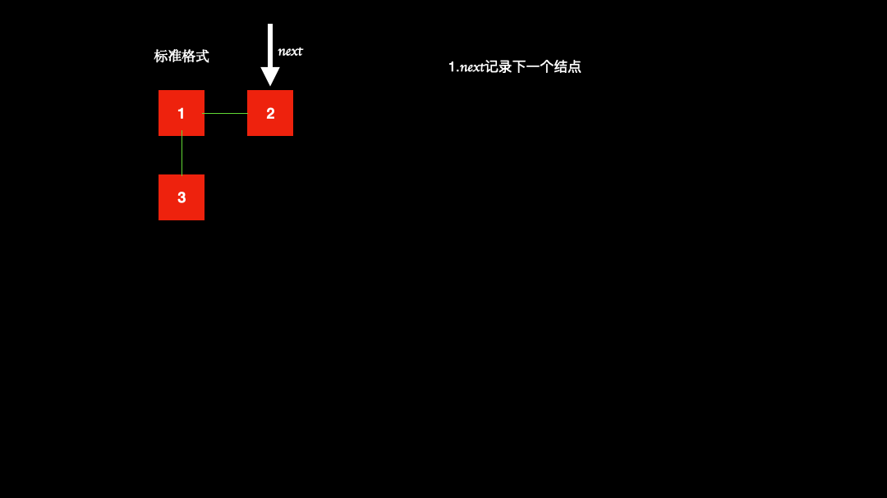

# 解题思路

## 1. 迭代

本题可用的方法就是迭代法，关注几个点：

* 当前结点是否有child结点，若没有，就继续向下移动
* 若是有child结点，需要以下操作
  * next记录当前结点（记为cur）下一个结点
  * 断开cur结点与next连接，与child结点相连
  * 递归child结点，并记录最后一个结点为last
* 如果next结点不为空，需要将last结点和next结点相连



### 1.1 代码

```java
public class Solution{
  public Node flatten(Node head) {
        if(head==null){
            return head;
        }
        Node cur  = head;
        while (cur!=null){
            Node next = cur.next;
            //child结点的最后一个结点
            Node last =null;
            if(cur.child!=null){//有child结点
                cur.next = cur.child;
                cur.next.prev = cur;
                Node child =  flatten(cur.child);
                last = getLast(child);
                if(next!=null){
                    last.next = next;
                    next.prev = last;
                }
                cur.child = null;
                cur = next;
            }else {//没有child 结点
                cur = cur.next;
            }
        }
        return head;
    }

    public Node getLast(Node node){
        while (node.next!=null){
            node = node.next;
        }
        return node;
    }
}
```

### 1.2 复杂度分析

* 时间复杂度：O(N),N为链表长度
* 空间复杂度：O(1)

