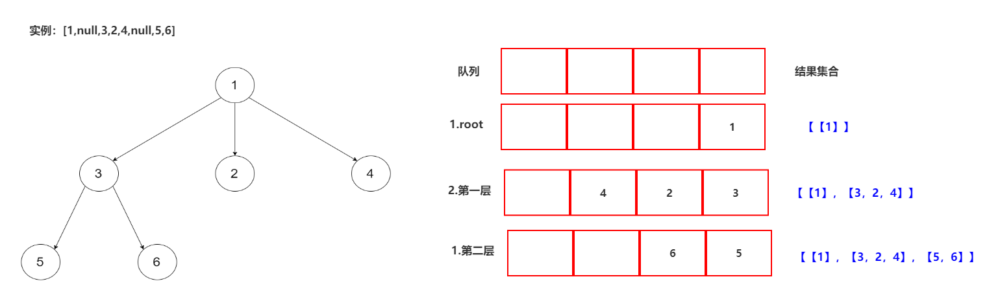

# 解题思路

## 1.队列+层序遍历

本体要求就是层序遍历，那么我们引入一个队列，用来保存每一层的结点，并完成按层遍历



### 1.1代码

```java
public class Solution {
    public List<List<Integer>> levelOrder(Node root) {
        List<List<Integer>> result  = new ArrayList<>();
        Deque<Node> deque = new ArrayDeque<>();
        deque.offer(root);
        //是否已经完成遍历
        while(deque.size()!=0){
            List<Integer> list = new ArrayList<>();
            //判断每层有多少结点
            int count = deque.size();
            while (count>0){
                Node node = deque.poll();
                list.add(node.val);
                //将children结点中的点加入队列中
                if(node.children!=null){
                    for (Node child:node.children) {
                        deque.offer(child);
                    }
                }
                count--;
            }
            result.add(list);

        }
        return result;
    }
}
```

### 1.2 复杂度分析

* 时间复杂度：O(N),N为树的结点总数，队列需要入队和出队操作
* 空间复杂度：O(N),队列所需使用到的极限空间